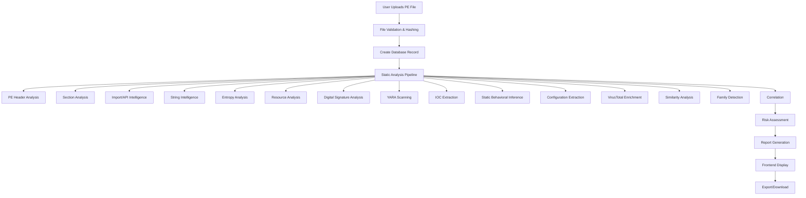
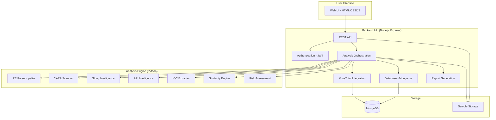

```markdown
# MalScope

> **Advanced Static Malware Analysis and Threat Intelligence Platform**

[](https://nodejs.org/)
[](https://expressjs.com/)
[](https://www.mongodb.com/)
[](https://www.python.org/)
[](LICENSE)

---

## Table of Contents

- [Overview](#overview)
- [Key Capabilities](#key-capabilities)
- [Why Static Analysis?](#why-static-analysis)
- [How MalScope Works](#how-malscope-works)
- [End-to-End Analysis Workflow](#end-to-end-analysis-workflow)
- [Evidence & Explainability](#evidence--explainability)
- [Architecture](#architecture)
- [Node.js ↔ Python Interaction](#nodejs--python-interaction)
- [Analysis Engine](#analysis-engine)
- [Threat Intelligence](#threat-intelligence)
- [Risk Assessment](#risk-assessment)
- [Reports](#reports)
- [Technology Stack](#technology-stack)
- [Project Structure](#project-structure)
- [Installation](#installation)
- [Configuration](#configuration)
- [Running MalScope](#running-malscope)
- [Quick Start](#quick-start)
- [API Documentation](#api-documentation)
- [Database Architecture](#database-architecture)
- [Security Considerations](#security-considerations)
- [Malware Safety Model](#malware-safety-model)
- [Limitations](#limitations)
- [Testing](#testing)
- [Development Status](#development-status)
- [Contributing](#contributing)
- [License](#license)

---

## Overview

**MalScope** is a comprehensive static malware analysis and threat intelligence platform designed for security analysts to investigate suspicious Windows Portable Executable (PE) files without executing them.

The platform combines **deep PE structural analysis**, **API intelligence**, **YARA scanning**, **IOC extraction**, **string intelligence**, **resource analysis**, **digital signature verification**, **similarity analysis**, and **malware family tracking** into a single, unified system.

MalScope is built on a modern **Node.js + Express + Python + MongoDB** stack, providing a robust REST API and a clean web interface for analysts to investigate malware samples, extract indicators of compromise, and generate detailed reports.

---

## Key Capabilities

### 1. Sample Management
- **Secure Upload**: Upload Windows PE files (exe, dll, sys, scr)
- **Hash Calculation**: SHA256, MD5, SHA1
- **Duplicate Detection**: Prevent re-analyzing the same file
- **File Validation**: Validate PE file format
- **Sample Storage**: Securely store samples on disk
- **Pagination & Filtering**: List and search samples efficiently
- **Tag Management**: Add/remove tags to categorize samples

### 2. Deep PE Structural Analysis
- **DOS Header**: Full DOS header parsing
- **COFF Header**: Machine type, sections count, characteristics
- **Optional Header**: PE32/PE32+ detection, subsystem, entry point, image base
- **Data Directories**: Export, Import, Resource, Security, Debug, TLS, etc.
- **Section Analysis**: Name, size, entropy, characteristics, permissions
- **Import Analysis**: DLL imports with API capability mapping
- **Export Analysis**: Exported functions and ordinals
- **Resource Analysis**: All resource types with entropy and size tracking

### 3. API Intelligence (Import Classification)
Classifies imported APIs into **11 capability categories** with severity ratings:

| Category | Description | Severity |
|----------|-------------|----------|
| **FILE** | File system operations | Medium |
| **PROCESS** | Process creation and manipulation | High |
| **MEMORY** | Memory allocation and manipulation | High |
| **REGISTRY** | Registry operations | Medium |
| **NETWORK** | Network communication | High |
| **CRYPTO** | Cryptographic operations | Medium |
| **PERSISTENCE** | Persistence mechanisms | High |
| **ANTI_ANALYSIS** | Anti-debugging and evasion | High |
| **PRIVILEGE_ESCALATION** | Privilege escalation attempts | Critical |
| **COMMAND_EXECUTION** | Command execution capability | High |
| **DATA_THEFT** | Data theft indicators | Critical |

### 4. String Intelligence
Classifies extracted strings into meaningful categories:

- **URLs**: HTTP/HTTPS/FTP URLs
- **Domains**: Domain names
- **IPv4/IPv6**: IP addresses
- **File Paths**: Windows file system paths
- **Registry Paths**: Windows registry keys
- **Commands**: CMD, PowerShell, WScript, etc.
- **Mutexes**: Mutex-like strings
- **Emails**: Email addresses
- **Suspicious Strings**: Ransomware, encryption, keylogging keywords

### 5. Resource + Signature Analysis
- **Resource Extraction**: All PE resources with metadata
- **Resource Classification**: UI, Data, Metadata, System categories
- **Suspicious Resource Detection**: Embedded scripts, suspicious patterns
- **Digital Signature Detection**: Signed/unsigned detection
- **Certificate Analysis**: Certificate chain, validity, issuer

### 6. YARA Scanning
- **Rule Management**: YARA rules in `rules/yara/` directory
- **Rule Execution**: Scan PE files against rules
- **Match Reporting**: Rule name, tags, matched strings
- **Severity Mapping**: Map rule matches to severity

### 7. IOC Extraction
Extracts Indicators of Compromise from multiple sources:
- **Hashes**: SHA256, MD5, SHA1
- **Domains**: Domain names from strings
- **IP Addresses**: IPv4 from strings
- **URLs**: HTTP/HTTPS URLs
- **File Paths**: File system paths
- **Registry Paths**: Registry keys

### 8. Static Behavioral Inference
Infers potential malware capabilities from static evidence:
- Network Communication
- File Manipulation
- Process Manipulation
- Persistence
- Registry Manipulation
- Anti-Analysis
- Crypto/Encryption
- Command Execution
- Data Theft

### 9. Similarity Engine
- **Feature Comparison**: Imports, sections, strings, YARA, IOCs
- **Similarity Score**: 0.0 to 1.0
- **Matched Features**: Detailed matching information
- **Related Samples**: Find samples similar to the current one

### 10. Malware Family Intelligence
- **Family Creation**: Create and manage malware families
- **Sample Association**: Associate samples to families
- **Family Detection**: Infer family from YARA, IOCs, imports
- **Top Families**: List families by sample count
- **Characteristics**: Common IOCs, imports, behaviors

### 11. Correlation Engine
Combines multiple evidence sources:
- PE Analysis → Structural evidence
- API Intelligence → Capability evidence
- Strings → String evidence
- YARA → Rule matches
- IOCs → Indicator matches
- VirusTotal → External intelligence

### 12. Risk Assessment
- **Risk Score**: 0-100 based on evidence
- **Risk Level**: LOW, MEDIUM, HIGH, CRITICAL
- **Contributors**: What contributed to the score
- **Explanation**: Human-readable explanation
- **Confidence**: Confidence in the assessment
- **Evidence Traceability**: Every finding traceable to evidence

### 13. VirusTotal Integration (Optional)
- **Hash Lookup**: Look up file by SHA256
- **Enrichment**: Add VT intelligence to analysis
- **Fallback**: Works without VT
- **Rate Limiting**: Handles API rate limits
- **Caching**: Caches VT results

### 14. Report Generation
Comprehensive malware analysis reports with sections:
1. Executive Summary
2. Sample Information
3. File Hashes
4. File Identification
5. PE Structure
6. Section Analysis
7. Import Analysis
8. String Analysis
9. Entropy Analysis
10. Packer/Obfuscation Assessment
11. Resource Analysis
12. Digital Signature Analysis
13. YARA Findings
14. Static Behavioral Inference
15. Configuration Indicators
16. IOC Analysis
17. VirusTotal Intelligence
18. Related Samples
19. Similarity Analysis
20. Correlated Findings
21. Risk Assessment
22. Final Verdict
23. Limitations

---

## Why Static Analysis?

Unlike dynamic analysis (which executes malware in a sandbox), static analysis examines the file structure, metadata, strings, imports, and other characteristics **without executing the code**. This approach is:

- ✅ **Safe** - No risk of malware execution
- ✅ **Fast** - Analysis completes in seconds
- ✅ **Scalable** - Can analyze thousands of samples
- ✅ **Reproducible** - Results are consistent and verifiable
- ✅ **Evidence-based** - Every finding is traceable to specific evidence

---

## How MalScope Works

MalScope processes malware samples through a multi-stage pipeline:

1. **Upload & Validation**: User uploads a PE file; system validates format and calculates hashes
2. **Static Analysis**: Python engine parses PE structure, extracts strings, imports, resources, and runs YARA
3. **API Intelligence**: Classifies imported APIs into capability categories
4. **IOC Extraction**: Extracts indicators from strings and PE metadata
5. **Behavioral Inference**: Infers potential malware capabilities from static evidence
6. **VirusTotal Enrichment** (Optional): Queries VirusTotal API for additional intelligence
7. **Similarity Analysis**: Compares sample against known samples in the database
8. **Family Detection**: Identifies potential malware family affiliation
9. **Correlation**: Combines all evidence into cohesive findings
10. **Risk Assessment**: Calculates risk score and level
11. **Report Generation**: Produces comprehensive analysis report
12. **Storage**: All results stored in MongoDB for future reference

---

## End-to-End Analysis Workflow



---

## Evidence & Explainability

Every finding in MalScope is **traceable** to specific evidence:

| Finding | Evidence Source | Traceability |
|---------|----------------|--------------|
| API Usage | Import Address Table | Specific DLL + Function |
| Network Behavior | String extraction | URLs, domains, IPs in strings |
| File Operations | Import analysis + strings | CreateFile, WriteFile + file paths |
| Persistence | Registry strings + imports | RegCreateKey, RegSetValue |
| Anti-Analysis | API imports | IsDebuggerPresent, NtSetInformationThread |
| YARA Match | PE sections + strings | Rule name + matched strings |
| Risk Score | Weighted combination | All contributing factors |

**Key Principle**: All behavioral conclusions are:
- ✅ **INFERRED** from static evidence
- ✅ **TRACEABLE** to specific evidence
- ✅ **EXPLAINABLE** in plain language

---

## Architecture



### Architecture Layers

| Layer | Technology | Responsibility |
|-------|------------|----------------|
| **Frontend** | HTML/CSS/JavaScript | User interface for analysts |
| **Backend API** | Node.js + Express | REST API, authentication, orchestration |
| **Analysis Engine** | Python 3.10+ | PE parsing, static analysis, YARA, IOC extraction |
| **Database** | MongoDB 6+ | Persistent storage of all intelligence data |
| **External** | VirusTotal API | Optional threat intelligence enrichment |

---

## Node.js ↔ Python Interaction

The Node.js backend communicates with the Python analysis engine via **child process**:

1. **No Microservice**: Python runs as a child process of Node.js
2. **CLI Interface**: Node.js spawns Python with CLI arguments and reads JSON output
3. **Simple Integration**: Easy to deploy and maintain
4. **Error Handling**: Node.js captures Python errors and logs them

**Communication Flow**:
```
Node.js --> spawn --> Python worker.py --mode static --sample /path/to/file
Python --> stdout --> JSON result
Node.js --> parse --> Store in MongoDB
```

---

## Analysis Engine

The Python analysis engine consists of the following modules:

### Core Modules

| Module | File | Purpose |
|--------|------|---------|
| **PE Analyzer** | `pe_analyzer.py` | Main PE file analysis orchestrator |
| **File Analyzer** | `file_analyzer.py` | File identification and classification |
| **Hash Analyzer** | `hash_analyzer.py` | Hash calculation (SHA256, MD5, SHA1) |
| **Header Analyzer** | `header_analyzer.py` | DOS, COFF, Optional header parsing |
| **Section Analyzer** | `section_analyzer.py` | PE section analysis and entropy |
| **Import Analyzer** | `import_analyzer.py` | Import table parsing |
| **Export Analyzer** | `export_analyzer.py` | Export table parsing |
| **String Analyzer** | `string_analyzer.py` | String extraction (ASCII/Unicode) |
| **String Intelligence** | `string_intelligence.py` | String classification by type |
| **API Intelligence** | `api_intelligence.py` | API capability classification |
| **Resource Analyzer** | `resource_analyzer.py` | Resource extraction and classification |
| **Certificate Analyzer** | `certificate_analyzer.py` | Digital signature analysis |
| **Entropy Analyzer** | `entropy_analyzer.py` | Entropy calculation |
| **YARA Analyzer** | `yara_analyzer.py` | YARA rule scanning |
| **TLS Analyzer** | `tls_analyzer.py` | TLS directory parsing |
| **Debug Analyzer** | `debug_analyzer.py` | Debug information parsing |
| **Rich Header Analyzer** | `rich_header_analyzer.py` | Rich header parsing |
| **Signature Analyzer** | `signature_analyzer.py` | Digital signature verification |

### Common Utilities

| Module | File | Purpose |
|--------|------|---------|
| **Models** | `models.py` | Data models for analysis results |
| **Result Formatter** | `result_formatter.py` | JSON output formatting |
| **API Categories** | `api_categories.json` | API capability mappings |
| **String Patterns** | `string_patterns.json` | String classification patterns |
| **Resource Types** | `resource_types.json` | Resource type definitions |

---

## Threat Intelligence

### IOC Management

MalScope stores and manages Indicators of Compromise extracted from analyzed samples:

- **Types**: SHA256, MD5, IP, Domain, URL, File Path, Registry Key
- **Source Tracking**: Static Analysis, VirusTotal, Manual
- **Confidence Scoring**: 0-1 confidence level
- **Severity**: Low, Medium, High, Critical
- **Context**: Additional metadata about the IOC
- **Tags**: Searchable tags for categorization

### VirusTotal Integration

Optional VirusTotal integration provides:

- **Hash Lookup**: Query by SHA256, MD5, SHA1
- **Detection Ratio**: Malicious detection count
- **Tags**: Threat tags and categories
- **Family Information**: Malware family mapping
- **Reputation**: File reputation score

### Similarity Analysis

- **Feature-Based**: Compares imports, sections, strings, YARA, IOCs
- **Weighted Scoring**: Different features have different weights
- **Threshold**: Configurable similarity threshold
- **Related Samples**: Find similar samples in the database

### Malware Family Intelligence

- **Family Creation**: Create named families
- **Sample Association**: Link samples to families
- **Automatic Detection**: Infer family from YARA, IOCs, imports
- **Characteristics**: Common features across family members

---

## Risk Assessment

The risk assessment engine combines multiple factors:

### Scoring Components

| Factor | Weight | Source |
|--------|--------|--------|
| API Capabilities | 25% | Import analysis |
| String Intelligence | 20% | String extraction |
| YARA Matches | 20% | YARA scanning |
| IOC Severity | 15% | IOC extraction |
| Resource Suspiciousness | 10% | Resource analysis |
| PE Characteristics | 10% | PE structure analysis |

### Risk Levels

- **CRITICAL** (80-100): High confidence malware with severe capabilities
- **HIGH** (60-79): Likely malware with significant threats
- **MEDIUM** (30-59): Suspicious but not confirmed
- **LOW** (0-29): Low risk or clean

### Evidence Traceability

Every risk assessment component is traceable to specific evidence:
- Which APIs contributed to the score
- Which strings were classified as suspicious
- Which YARA rules matched
- Which IOCs were extracted
- Which PE characteristics were flagged

---

## Reports

MalScope generates comprehensive analysis reports in multiple formats:

### Available Formats

- **JSON**: Full structured data for programmatic use
- **CSV**: Tabular data for analysis tools

### Report Structure

1. **Executive Summary**: High-level findings and verdict
2. **Sample Information**: Filename, size, type, architecture
3. **File Hashes**: SHA256, MD5, SHA1
4. **File Identification**: PE type, subsystem, linker version
5. **PE Structure**: Headers, data directories
6. **Section Analysis**: All sections with entropy
7. **Import Analysis**: All imported DLLs and functions
8. **String Analysis**: Classified strings
9. **Entropy Analysis**: Overall and per-section entropy
10. **Packer/Obfuscation Assessment**: Detection of packers
11. **Resource Analysis**: All resources with details
12. **Digital Signature Analysis**: Signature verification
13. **YARA Findings**: All YARA rule matches
14. **Static Behavioral Inference**: Inferred capabilities
15. **Configuration Indicators**: Extracted configuration
16. **IOC Analysis**: All extracted indicators
17. **VirusTotal Intelligence**: External intelligence
18. **Related Samples**: Similar samples in database
19. **Similarity Analysis**: Detailed similarity comparison
20. **Correlated Findings**: Combined evidence
21. **Risk Assessment**: Score, level, contributors
22. **Final Verdict**: Overall assessment
23. **Limitations**: Analysis constraints

---

## Technology Stack

| Layer | Technology | Version |
|-------|------------|---------|
| **Backend** | Node.js | 18.x+ |
| **Framework** | Express.js | 4.x |
| **Database** | MongoDB | 6.x+ |
| **ODM** | Mongoose | 8.x |
| **Authentication** | JWT + bcrypt | - |
| **Analysis Engine** | Python | 3.10+ |
| **PE Parsing** | pefile | 2024.x |
| **YARA** | yara-python | 4.5.x |
| **API** | RESTful JSON | - |
| **Frontend** | HTML/CSS/JS | - |
| **Charts** | Chart.js | 4.x |
| **Icons** | Lucide | - |

---

## Project Structure

```
MalScope/
│
├── backend/                          # Node.js + Express API
│   ├── src/
│   │   ├── config/                   # Configuration files
│   │   │   ├── database.js           # MongoDB connection
│   │   │   ├── environment.js        # Environment variables
│   │   │   └── virusTotal.js         # VirusTotal config
│   │   │
│   │   ├── controllers/              # API controllers
│   │   │   ├── authController.js
│   │   │   ├── sampleController.js
│   │   │   ├── analysisController.js
│   │   │   ├── staticAnalysisController.js
│   │   │   ├── threatIntelController.js
│   │   │   ├── reportController.js
│   │   │   └── dashboardController.js
│   │   │
│   │   ├── services/                 # Business logic
│   │   │   ├── sampleService.js
│   │   │   ├── analysisService.js
│   │   │   ├── staticAnalysisService.js
│   │   │   ├── pythonAnalysisService.js
│   │   │   ├── virusTotalService.js
│   │   │   ├── iocService.js
│   │   │   ├── configurationService.js
│   │   │   ├── similarityService.js
│   │   │   ├── familyIntelligenceService.js
│   │   │   ├── correlationService.js
│   │   │   ├── riskService.js
│   │   │   └── reportService.js
│   │   │
│   │   ├── models/                   # Mongoose models
│   │   │   ├── User.js
│   │   │   ├── MalwareSample.js
│   │   │   ├── Analysis.js
│   │   │   ├── StaticAnalysis.js
│   │   │   ├── VirusTotalReport.js
│   │   │   ├── IOC.js
│   │   │   ├── Behavior.js
│   │   │   ├── ConfigurationIndicator.js
│   │   │   ├── SimilarityResult.js
│   │   │   ├── MalwareFamily.js
│   │   │   └── ThreatAssessment.js
│   │   │
│   │   ├── routes/                   # API routes
│   │   │   ├── authRoutes.js
│   │   │   ├── sampleRoutes.js
│   │   │   ├── analysisRoutes.js
│   │   │   ├── staticAnalysisRoutes.js
│   │   │   ├── threatIntelRoutes.js
│   │   │   ├── reportRoutes.js
│   │   │   └── dashboardRoutes.js
│   │   │
│   │   ├── middleware/               # Express middleware
│   │   │   ├── authMiddleware.js
│   │   │   ├── uploadMiddleware.js
│   │   │   ├── validationMiddleware.js
│   │   │   ├── rateLimitMiddleware.js
│   │   │   └── errorMiddleware.js
│   │   │
│   │   ├── utils/                    # Utility functions
│   │   │   ├── hashUtils.js
│   │   │   ├── fileUtils.js
│   │   │   ├── logger.js
│   │   │   └── analysisStatus.js
│   │   │
│   │   └── server.js                 # Entry point
│   │
│   ├── tests/                        # Backend tests
│   ├── package.json
│   └── .env.example
│
├── analysis-engine/                  # Python analysis engine
│   ├── common/                       # Shared models and utilities
│   │   ├── models.py                 # Data models
│   │   ├── result_formatter.py       # JSON formatter
│   │   ├── api_categories.json       # API category definitions
│   │   ├── string_patterns.json      # String patterns
│   │   └── resource_types.json       # Resource type definitions
│   │
│   ├── static/                       # Static analysis modules
│   │   ├── pe_analyzer.py            # Main PE analyzer
│   │   ├── file_analyzer.py          # File identification
│   │   ├── hash_analyzer.py          # Hash calculation
│   │   ├── section_analyzer.py       # Section analysis
│   │   ├── import_analyzer.py        # Import analysis
│   │   ├── entropy_analyzer.py       # Entropy analysis
│   │   ├── string_analyzer.py        # String extraction
│   │   ├── string_intelligence.py    # String classification
│   │   ├── api_intelligence.py       # API classification
│   │   ├── resource_analyzer.py      # Resource analysis
│   │   ├── certificate_analyzer.py   # Certificate analysis
│   │   ├── header_analyzer.py        # PE header analysis
│   │   ├── tls_analyzer.py           # TLS analysis
│   │   ├── debug_analyzer.py         # Debug info analysis
│   │   ├── rich_header_analyzer.py   # Rich header analysis
│   │   ├── signature_analyzer.py     # Digital signature analysis
│   │   └── yara_analyzer.py          # YARA scanning
│   │
│   ├── worker.py                     # Entry point
│   ├── requirements.txt
│   └── README.md
│
├── frontend/                         # Web interface
│   ├── index.html                    # Login page
│   ├── dashboard.html                # Main dashboard
│   ├── samples.html                  # Sample management
│   ├── analysis.html                 # Static analysis viewer
│   ├── static-analyses.html          # Analysis list
│   ├── reports.html                  # Report generation
│   ├── threat-intel.html             # Threat intelligence
│   ├── iocs.html                     # IOC management
│   ├── behaviors.html                # Behavior detection
│   ├── users.html                    # User management
│   │
│   ├── assets/
│   │   ├── css/
│   │   │   └── style.css             # Main stylesheet
│   │   ├── js/
│   │   │   ├── auth.js               # Authentication
│   │   │   ├── dashboard.js          # Dashboard
│   │   │   ├── samples.js            # Sample management
│   │   │   ├── analysis.js           # Analysis viewer
│   │   │   ├── static-analyses.js    # Analysis list
│   │   │   ├── reports.js            # Report generation
│   │   │   ├── threat-intel.js       # Threat intelligence
│   │   │   ├── iocs.js               # IOC management
│   │   │   ├── behaviors.js          # Behavior detection
│   │   │   ├── users.js              # User management
│   │   │   └── sidebar.js            # Sidebar navigation
│   │   └── vendor/                   # Third-party libraries
│   │       ├── tailwind.js
│   │       ├── sweetalert2.js
│   │       ├── chart.js
│   │       └── lucide.js
│   │
│   └── docs/                         # Documentation
│       └── images/                   # Screenshots
│
├── storage/                          # File storage
│   └── samples/                      # Sample files
│       ├── pending/
│       ├── analyzing/
│       ├── completed/
│       └── failed/
│
├── rules/                            # Detection rules
│   └── yara/                         # YARA rules
│       ├── generic.yar
│       ├── suspicious_pe.yar
│       ├── ransomware.yar
│       ├── trojan.yar
│       └── downloader.yar
│
├── docs/                             # Documentation
│   ├── architecture.md
│   ├── static-analysis.md
│   ├── api.md
│   ├── database.md
│   ├── security.md
│   └── testing.md
│
├── .gitignore
├── README.md
├── LICENSE
└── docker-compose.yml
```

---

## Installation

### Prerequisites

- **Node.js** 18.x or higher
- **Python** 3.10 or higher
- **MongoDB** 6.x or higher
- **Git** (for cloning)

### Step 1: Clone the Repository

```bash
git clone https://github.com/yourusername/malscope.git
cd malscope
```

### Step 2: Backend Setup

```bash
cd backend
npm install
cp .env.example .env
# Edit .env with your configuration
```

### Step 3: Python Analysis Engine Setup

```bash
cd ../analysis-engine
python -m venv venv
source venv/bin/activate  # On Windows: venv\Scripts\activate
pip install -r requirements.txt
```

### Step 4: Database Setup

```bash
# Start MongoDB (if not already running)
mongod --dbpath /path/to/data/db

# Or if using Docker:
docker run -d -p 27017:27017 --name mongodb mongo:6
```

### Step 5: Environment Configuration

Create `.env` file in the `backend` directory:

```env
# Server
NODE_ENV=development
PORT=5000

# MongoDB
MONGODB_URI=mongodb://localhost:27017/malscope

# JWT
JWT_SECRET=your-secret-key-change-me

# VirusTotal (Optional)
VT_API_KEY=your-virustotal-api-key
```

---

## Configuration

### Environment Variables

| Variable | Description | Required | Default |
|----------|-------------|----------|---------|
| `NODE_ENV` | Environment mode | No | `development` |
| `PORT` | Server port | No | `5000` |
| `MONGODB_URI` | MongoDB connection string | Yes | - |
| `JWT_SECRET` | JWT signing secret | Yes | - |
| `VT_API_KEY` | VirusTotal API key | No | - |
| `VM_NAME` | VirtualBox VM name | No | - |
| `VM_SNAPSHOT` | VM snapshot name | No | - |
| `VM_USER` | VM username | No | - |
| `VM_PASSWORD` | VM password | No | - |

---

## Running MalScope

### Start MongoDB

```bash
# If installed locally
mongod

# Or using Docker
docker start mongodb
```

### Start the Backend Server

```bash
cd backend
npm run dev
```

### Test the Python Worker

```bash
cd analysis-engine
python worker.py --mode test
```

### Run Static Analysis

```bash
cd analysis-engine
python worker.py --mode static --sample /path/to/sample.exe
```

---

## Quick Start

```bash
# 1. Clone and setup
git clone https://github.com/yourusername/malscope.git
cd malscope

# 2. Backend
cd backend
npm install
cp .env.example .env
npm run dev

# 3. Python engine (in another terminal)
cd analysis-engine
python -m venv venv
source venv/bin/activate
pip install -r requirements.txt
python worker.py --mode test

# 4. Access the application
# Open browser: http://localhost:5000
# Default login: admin / admin (if configured)
```

---

## API Documentation

### Authentication

| Method | Endpoint | Description | Auth |
|--------|----------|-------------|------|
| POST | `/api/v1/auth/register` | Register a new user | No |
| POST | `/api/v1/auth/login` | Login user | No |
| POST | `/api/v1/auth/logout` | Logout user | Yes |
| GET | `/api/v1/auth/me` | Get current user profile | Yes |
| PUT | `/api/v1/auth/me` | Update user profile | Yes |
| PUT | `/api/v1/auth/change-password` | Change password | Yes |
| POST | `/api/v1/auth/refresh` | Refresh JWT token | Yes |

### Samples

| Method | Endpoint | Description | Auth |
|--------|----------|-------------|------|
| POST | `/api/v1/samples` | Upload a sample | Yes |
| GET | `/api/v1/samples` | List samples | Yes |
| GET | `/api/v1/samples/stats` | Get sample statistics | Yes |
| GET | `/api/v1/samples/hash/:hash` | Get sample by hash | Yes |
| GET | `/api/v1/samples/:id` | Get sample by ID | Yes |
| GET | `/api/v1/samples/:id/download` | Download sample file | Yes |
| PATCH | `/api/v1/samples/:id/status` | Update sample status | Yes |
| DELETE | `/api/v1/samples/:id` | Delete sample | Admin |
| POST | `/api/v1/samples/:id/tags` | Add tags to sample | Yes |
| DELETE | `/api/v1/samples/:id/tags` | Remove tags from sample | Yes |

### Analysis

| Method | Endpoint | Description | Auth |
|--------|----------|-------------|------|
| POST | `/api/v1/analyses` | Start a new analysis | Yes |
| GET | `/api/v1/analyses/stats` | Get analysis statistics | Yes |
| GET | `/api/v1/analyses/:id/status` | Get analysis status | Yes |
| GET | `/api/v1/analyses/:id` | Get analysis by ID | Yes |
| GET | `/api/v1/analyses/sample/:sampleId` | Get analyses for a sample | Yes |
| POST | `/api/v1/analyses/:id/cancel` | Cancel an analysis | Yes |

### Static Analysis

| Method | Endpoint | Description | Auth |
|--------|----------|-------------|------|
| GET | `/api/v1/analyses/:id/static` | Get full static analysis results | Yes |
| GET | `/api/v1/analyses/:id/static/summary` | Get static analysis summary | Yes |
| GET | `/api/v1/analyses/:id/static/api-intelligence` | Get API intelligence | Yes |
| GET | `/api/v1/analyses/:id/static/high-risk-apis` | Get high-risk APIs | Yes |
| GET | `/api/v1/analyses/:id/static/string-intelligence` | Get string intelligence | Yes |
| GET | `/api/v1/analyses/:id/static/yara` | Get YARA matches | Yes |
| GET | `/api/v1/analyses/:id/static/findings` | Get findings | Yes |
| GET | `/api/v1/analyses/:id/static/pe-info` | Get PE file information | Yes |
| GET | `/api/v1/analyses/:id/static/resources/summary` | Get resource summary | Yes |
| GET | `/api/v1/analyses/:id/static/resources/details` | Get resource details | Yes |
| GET | `/api/v1/analyses/:id/static/signature` | Get signature analysis | Yes |
| GET | `/api/v1/analyses/:id/static/exists` | Check if static analysis exists | Yes |
| POST | `/api/v1/analyses/:id/static/rerun` | Rerun static analysis | Yes |

### Threat Intelligence

| Method | Endpoint | Description | Auth |
|--------|----------|-------------|------|
| GET | `/api/v1/threat-intel/iocs/search` | Search IOCs | Yes |
| GET | `/api/v1/threat-intel/iocs/stats` | Get IOC statistics | Yes |
| GET | `/api/v1/threat-intel/iocs/:id` | Get IOC by ID | Yes |
| PATCH | `/api/v1/threat-intel/iocs/:id` | Update IOC | Yes |
| DELETE | `/api/v1/threat-intel/iocs/:id` | Delete IOC | Admin |
| GET | `/api/v1/threat-intel/samples/:sampleId/iocs` | Get IOCs for a sample | Yes |
| GET | `/api/v1/threat-intel/config/samples/:sampleId` | Get configuration indicators | Yes |
| GET | `/api/v1/threat-intel/config/search` | Search configuration indicators | Yes |
| GET | `/api/v1/threat-intel/config/stats` | Get config indicator stats | Yes |
| GET | `/api/v1/threat-intel/similarity/samples/:sampleId` | Get similarity results | Yes |
| GET | `/api/v1/threat-intel/similarity/related/:sampleId` | Get related samples | Yes |
| GET | `/api/v1/threat-intel/families` | List malware families | Yes |
| GET | `/api/v1/threat-intel/families/top` | Get top malware families | Yes |
| GET | `/api/v1/threat-intel/families/:id` | Get family by ID | Yes |
| GET | `/api/v1/threat-intel/families/name/:name` | Get family by name | Yes |
| GET | `/api/v1/threat-intel/families/sample/:sampleId` | Get family for a sample | Yes |
| POST | `/api/v1/threat-intel/families` | Create a family | Admin |
| POST | `/api/v1/threat-intel/families/:id/sample` | Add sample to family | Admin |
| DELETE | `/api/v1/threat-intel/families/:id/sample/:sampleId` | Remove sample from family | Admin |
| GET | `/api/v1/threat-intel/virustotal/:hash` | VirusTotal lookup | Yes |
| GET | `/api/v1/threat-intel/related/:type/:value` | Get related samples by IOC | Yes |
| GET | `/api/v1/threat-intel/summary` | Get threat intelligence summary | Yes |

### Reports

| Method | Endpoint | Description | Auth |
|--------|----------|-------------|------|
| GET | `/api/v1/reports/formats` | Get available report formats | Yes |
| POST | `/api/v1/reports/:analysisId` | Generate a report | Yes |
| GET | `/api/v1/reports/:analysisId` | Get a report | Yes |
| GET | `/api/v1/reports/:analysisId/summary` | Get report summary | Yes |
| GET | `/api/v1/reports/:analysisId/exists` | Check if report exists | Yes |
| GET | `/api/v1/reports/:analysisId/download/json` | Download report as JSON | Yes |
| GET | `/api/v1/reports/:analysisId/download/csv` | Download report as CSV | Yes |

### Dashboard

| Method | Endpoint | Description | Auth |
|--------|----------|-------------|------|
| GET | `/api/v1/dashboard/stats` | Get dashboard statistics | Yes |
| GET | `/api/v1/dashboard/timeline` | Get timeline data | Yes |
| GET | `/api/v1/dashboard/alerts` | Get alerts | Yes |
| GET | `/api/v1/dashboard/widgets` | Get widgets data | Yes |
| GET | `/api/v1/dashboard/daily` | Get daily summary | Yes |

---

## Database Architecture

### Core Collections

| Collection | Description | Key Fields |
|------------|-------------|------------|
| `users` | User accounts | username, email, role |
| `malwaresamples` | Malware sample records | filename, sha256, md5, status |
| `analyses` | Analysis jobs | sample, status, stages |
| `staticanalyses` | Static analysis results | sample, fileInfo, sections, imports |
| `iocs` | Indicators of Compromise | type, value, severity, sample |
| `behaviors` | Inferred behaviors | category, severity, description |
| `configurationindicators` | Configuration data | type, value, sample |
| `similarityresults` | Sample similarity comparisons | sample, matches, score |
| `malwarefamilies` | Malware family definitions | name, samples, characteristics |
| `threatassessments` | Risk assessments | sample, score, level |
| `virustotalreports` | VirusTotal data | hash, detection, tags |

---

## Security Considerations

### 1. Malware Handling
- **Never execute samples** on the host system
- All samples are treated as **untrusted binary data**
- Samples are stored with **randomized filenames**
- File uploads are **size-limited** (100MB default)

### 2. Authentication & Authorization
- **JWT-based authentication** with expiration
- **Role-based access control** (admin, analyst, viewer)
- **Password hashing** using bcrypt
- **Rate limiting** on authentication endpoints

### 3. API Security
- **Input validation** on all endpoints
- **Sanitization** of user inputs
- **Rate limiting** on API endpoints
- **CORS** properly configured
- **Helmet.js** for security headers

### 4. Database Security
- **Parameterized queries** via Mongoose
- **NoSQL injection** protection
- **Connection string** secured via environment variables

### 5. File Security
- **File type validation** on upload
- **File size limits**
- **Storage path** validation
- **No direct file execution**

### 6. Logging & Monitoring
- **Structured logging** with severity levels
- **No sensitive data** in logs
- **Error tracking** with stack traces in development only

---

## Testing

### Backend Tests

```bash
cd backend
npm test
```

### Python Engine Tests

```bash
cd analysis-engine
python -m pytest tests/
```

### End-to-End Testing

```bash
# Ensure MongoDB is running
# Start the backend server
cd backend
npm run dev

# Run E2E tests
npm run test:e2e
```


## Contributing

### Development Process

1. **Fork** the repository
2. **Create** a feature branch (`git checkout -b feature/amazing-feature`)
3. **Commit** your changes (`git commit -m 'Add amazing feature'`)
4. **Push** to the branch (`git push origin feature/amazing-feature`)
5. **Open** a Pull Request

### Guidelines

- Follow existing code style
- Write tests for new features
- Update documentation
- Keep commits focused and atomic

---

## License

This project is licensed under the MIT License - see the [LICENSE](LICENSE) file for details.

---

## Support

For issues, questions, or contributions, please [open an issue](https://github.com/hatimdaginawala/MalScope) on GitHub.

---
